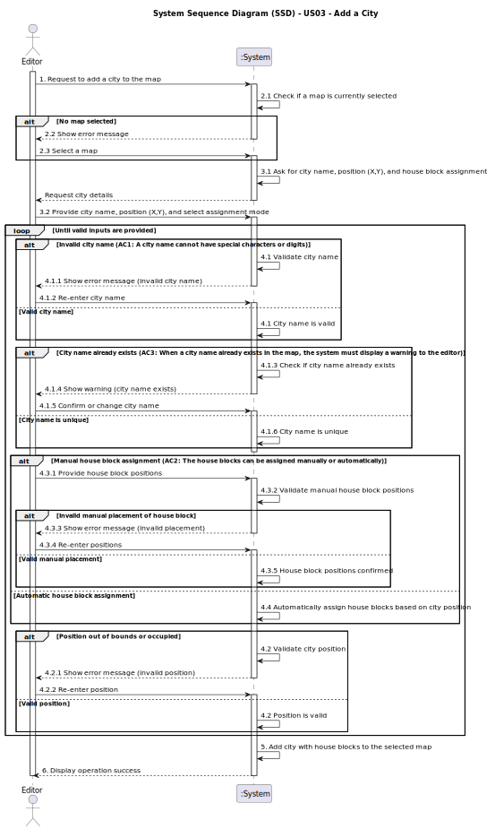

# US03 - Add a City

## 1. Requirements Engineering

### 1.1. User Story Description

>As an Editor, I want to add a city in a position XY of the selected map, with a name and a positive number of house blocks.

### 1.2. Customer Specifications and Clarifications

### Customer enquiries
>**Question:** How should the city name be validated before being added to the map?
> 
>**Answer:** The city name must be validated to ensure it does not contain special characters or digits.
> 
> [Customer Specification - Integrative Project Assignment (Version 1.1)](https://moodle.isep.ipp.pt/mod/resource/view.php?id=261025)

>**Question:** According to User Story 3, the name of the city must be unique within the same map?
>
>**Answer:** It can be repeated but can become confusing for players, the editor should be alerted to the situation.
> 
> [Customer Clarification - Fórum](https://moodle.isep.ipp.pt/mod/forum/discuss.php?d=35050)

>**Question:** Is there a minimum or maximum number of house blocks that can be assigned?
> 
>**Answer:** The number needs to be a positive on; there is no maximum, it's up to the editor to decide.
> 
> [Customer Clarification - Fórum](https://moodle.isep.ipp.pt/mod/forum/discuss.php?d=35180)

>**Question:** What options are available for assigning house blocks to the city?
>
>**Answer:** House blocks can be assigned manually by the editor or generated automatically.
In the case of automatic generation, the blocks are randomly distributed around the city tag position following a normal distribution.
> 
> [Customer Specification - Integrative Project Assignment (Version 1.1)](https://moodle.isep.ipp.pt/mod/resource/view.php?id=261025)

>**Question:** Can a city be destroyed by natural disasters/war?
>
>**Answer:** Cities can only be removed in edit mode, not during simulation.
> 
>  [Customer Clarification - Fórum](https://moodle.isep.ipp.pt/mod/forum/discuss.php?d=35189#p44490)

>**Question:** What is the purpose and meaning of the "City Tag"?
>
>It's a label that would appear in the map if a GUI is considered.
>
> [Customer Clarification - Fórum](https://moodle.isep.ipp.pt/mod/forum/discuss.php?d=34935)

>**Question:** Does the city have a specific radius for some functionality or is the city creation just figurative?
>
>**Answer:** No, it's the center, that can be useful if the positions for the House Blocks as randomly generated.
> 
> [Customer Clarification](https://moodle.isep.ipp.pt/mod/forum/discuss.php?d=34935)

>**Question**: What exactly are "cities"? Are they entities that automatically produce people and mail based on the total number of house blocks, or do we also need to consider whether the house blocks themselves are located within the economic radius of a station?
> 
>**Answer**: Cities are places with a name, a location and a number of house blocks. Each house block functions as an industry blocks but generates mail/passengers, and demand mail/passangers and final produts like food or goods.
> 
> [Customer Clarification](https://moodle.isep.ipp.pt/mod/forum/discuss.php?d=34977)

>**Question:** Is it possible to place a station inside a city without touching any house blocks, resulting in no production?
> 
>**Answer:** The house blocks will accept and generate cargos when inside the economic radius of a station as other industries.
> 
> [Customer Clarification](https://moodle.isep.ipp.pt/mod/forum/discuss.php?d=34977)

>**Question:** When the editor creates a city, what is the radius within which house blocks can be placed?
> 
>**Answer:** If you consider a normal distribution the probability of being far from the town center becames zero.
>
> [Customer Clarification](https://moodle.isep.ipp.pt/mod/forum/discuss.php?d=34977)

>**Question:** Is there a minimum and/or maximum number of house blocks that can be placed when creating a city?
>
>**Answer:** No.
>
> [Customer Clarification](https://moodle.isep.ipp.pt/mod/forum/discuss.php?d=34977)

### 1.3. Acceptance Criteria

>AC1: A city name cannot have special characters or digits.

>AC2: The house blocks can be assigned manually or automatically (randomly around the city tag position accordingly to normal distribution).

>AC3: When a city name already exists in the map, the system must display a warning to the editor.

### 1.4. Found out Dependencies

>This User Story depends on US01 and US02:

>US01 - Create a map with size and name.   
>- Dependency: US03 depends on US01 to ensure there is a valid map where the city can be added.

>US02 - Add an industry to the map.   
>- Dependency: Both cities (US03) and industries (US02) are elements added to the map. 
While it is not strictly necessary to add an industry before a city, the two systems must be aligned to avoid conflicts in the positioning of elements on the map.

### 1.5 Input and Output Data
>**Input**
> 
>The editor must input the city name (typed data, without special characters or digits), the number of house blocks (typed data - positive integer), and the XY coordinates (typed data - positive integers) on the selected map.

>**Output**
> 
> The system outputs a confirmation message upon successful city creation, a warning if the city name is duplicated, or an error message if invalid data is provided.

### 1.6. System Sequence Diagram (SSD)

### 1.7 Other Relevant Remarks

>**Special requirements:**
> 
>- The system must ensure that adding a city does not interfere with existing elements on the map, such as industries or other cities.
>- If automatic generation is selected, the system must implement a normal distribution algorithm to randomize house block positions around the city’s XY coordinates.
>- Although duplicate city names are allowed, the editor should be warned as this can confuse the playerExample.

>**(ii) How often this US is held:**
>
>This user story (US03) is used each time an editor wants to populate the map with cities.
